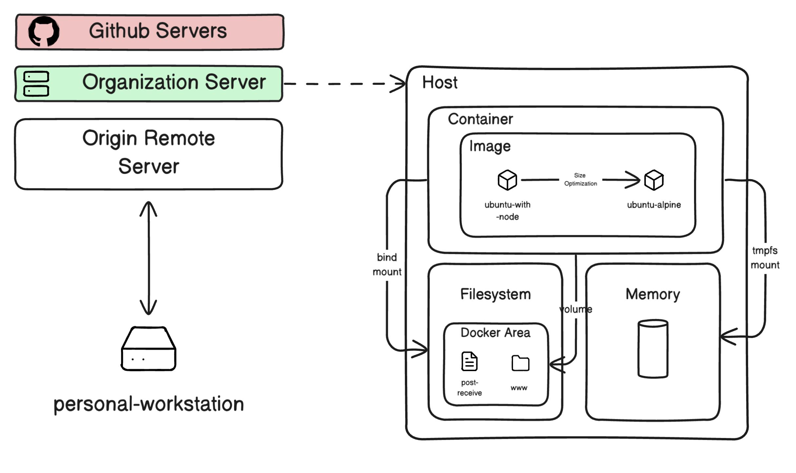
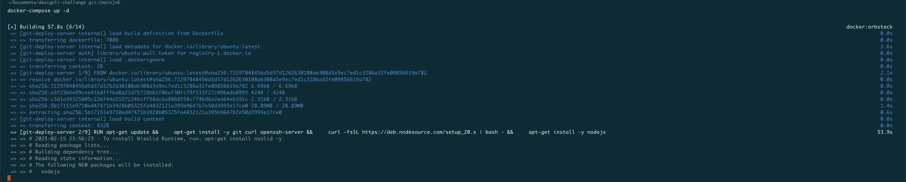
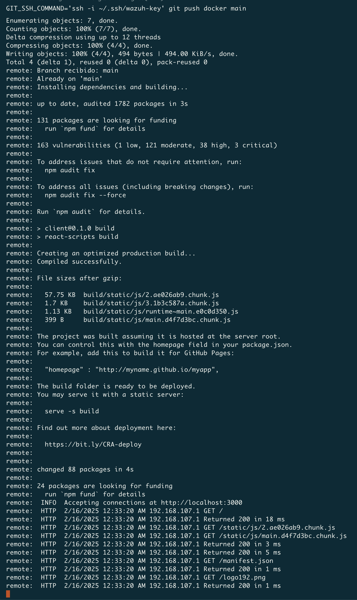
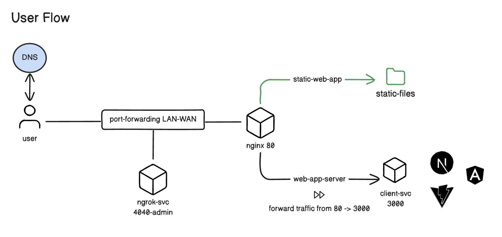
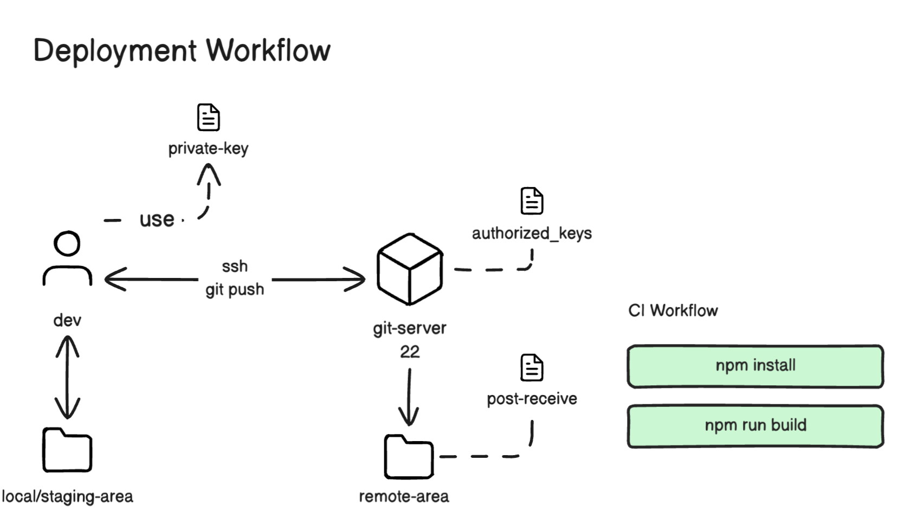

# Designli Challenge

## Overview

**The easy one:**

Create a Docker container with a Linux server (Ubuntu or Alpine preferred) and install Node.js.

1. Create a script that sets up a remote Git repository on the server, including a post-receive hook that allows automatic deployment when code is pushed. (Example: DigitalOcean Guide). You should be able to do something like git push docker main, being docker a remote url configured to point to the Docker container.

2. Create a simple React application displaying Hello XXX, where the value of XXX is read from an .env file.

3. Push your React application to the remote repository on the server and verify that it is automatically deployed and running.

Proposal Design:



Steps of our implementation:

## Automated Deployment

1. We create a Dockerfile to build our image. This docker file is based on the ubuntu:latest image and installs git, curl, openssh-server, and nodejs. We also create the necessary directories for the git repository and the website. We initialize a git repository and configure SSH for access. We also configure SSHD and expose port 22. Make sure to copy the authorized_keys file to the container to allow access. This authorized_keys file contains the public key of the machine that will push the code to the repository.

2. Then we create our docker-compose file to run our container. We expose port 2222 to access the SSH server. We also mount the post-receive hook and the website directory to the container. This way, we can push the code to the repository and see the changes in the website directory.

3. Then we create the post-receive hook. This script is executed when code is pushed to the repository. It receives the code and copies it to the website directory. It also installs the dependencies and builds the React application.

> [!NOTE]
> Ensure that the post-receive hook has the correct permissions to execute. You can do this by running chmod +x post-receive.

```bash
chmod +x post-receive
```

## Client Application

We have created a simple React application that displays Hello XXX, where XXX is read from an .env file. We have also created a .env file with the value of XXX.

```bash
npx create-react-app client
```

Create a .env file with the following content:

```bash
REACT_APP_NAME=World
```

Modify the App.js file to read the value of REACT_APP_NAME from the .env file.

```javascript
import React from 'react';

function App() {
  return (
    <div>
      <h1>Hello {process.env.REACT_APP_NAME}</h1>
    </div>
  );
}

export default App;
```

## Configure the Remote Repository

We configure the remote repository on the server to point to the Docker container. We add the remote repository to the client application and push the code to the server.

```bash
cd client
git init
git remote add docker ssh://docker@localhost:2222/var/repo/site.git
git remote set-url docker "ssh://root@localhost:2222/var/repo/site.git" # Specify private key to git
```

## Execute the Deployment

We push the code to the remote repository on the server and verify that it is automatically deployed and running.

```bash
docker-compose up
```



```bash
git add .
git commit -m "Deploy"
GIT_SSH_COMMAND='ssh -i ~/.ssh/id_rsa' git push docker main
```



**The real challenge**

1. Extend the previous setup by configuring an Nginx reverse proxy to serve the React application.

2. Expose the reverse proxy publicly using ngrok.

3. Use different containers in docker-compose.yml for frontend, nginx and ngrok.

4. Ensure that the deployment process remains automated, meaning that any push to the remote repository triggers a deployment without manual intervention.


## User Flow

#### Overview

The diagram illustrates the user flow for accessing a web application served through a combination of Nginx, Ngrok, and a client service. This setup is particularly useful for local development environments exposed to the public internet.



Step-by-Step Flow

1. User Access via DNS:

A user accesses the application through a DNS-resolved address or the public URL provided by Ngrok.

2. Port Forwarding (LAN-WAN):

The user's request is forwarded from the local network to the appropriate services through port forwarding.

3. Ngrok Service (4040 Admin Panel):

Ngrok is employed to expose the local application to the public internet. The admin panel is available on localhost:4040 to monitor and inspect the traffic passing through the tunnel.

4. Nginx Service (Port 80):

Nginx acts as a reverse proxy, receiving incoming traffic and directing it to the appropriate internal services.

5. Static Web App (Implemented):

Nginx serves static files (e.g., React build output) from a directory to handle frontend requests.

6. Web App Server (Proxy Traffic from 80 to 3000): **(Optional)**

Nginx also proxies API or dynamic requests to the client service running on port 3000.

7. Client Service (Port 3000): **(Optional)**

This is the frontend development server running React, Vite, Next.js, or Angular.

Key Ports

80: Nginx serving frontend and proxying requests.

4040: Ngrok admin panel for traffic inspection.


## Deployment Workflow

#### Overview

This document describes the automated deployment workflow depicted in the diagram. The process leverages a Git-based deployment strategy using SSH authentication and a post-receive hook to automatically build and deploy a React application upon pushing changes to the remote repository.



Flow Description

1. Local Development Area

local/staging-area: This is the developer's local working directory containing the source code of the project.

dev: The developer works in this environment, making changes and testing locally.

2. SSH Authentication

The developer uses a private-key for authentication when pushing code via SSH to the git-server.

The git-server holds an authorized_keys file that contains the public key of the developer, enabling secure SSH access.

3. Pushing Changes

The developer pushes changes to the git-server using:

git push

SSH communication is established over port 22.

4. Git Server

The git-server is configured with a post-receive hook.

When the push is received, the post-receive hook is triggered to deploy the code to the remote-area directory.

5. Deployment Area

remote-area: This is the directory on the server where the application is deployed.

6. Continuous Integration (CI) Workflow

Upon receiving new code, the post-receive hook triggers the following commands:

npm install: Installs the project dependencies.

npm run build: Builds the production version of the React application.
